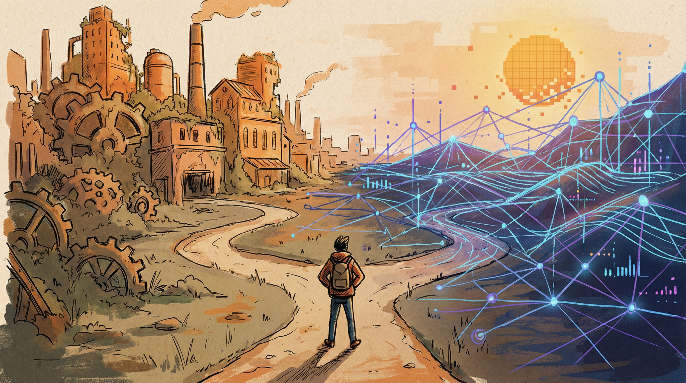
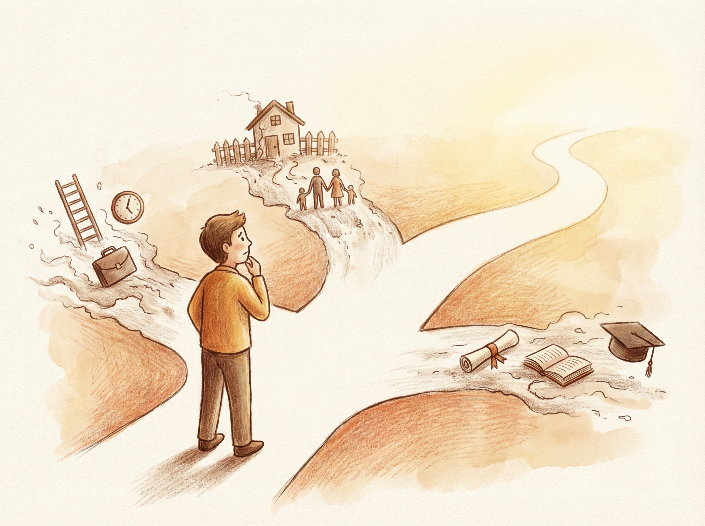
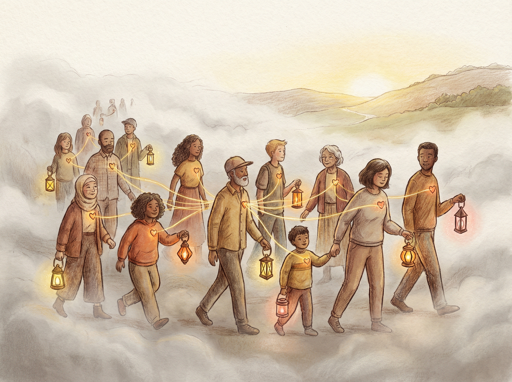

# AI时代生存指南：旧秩序在松动，新秩序长什么样？

---

前两天看到一篇[[范式转换不是旧框架的修修补补，而是整个世界观的更替]]，标题很直接：**"范式转换不是旧框架的修修补补，而是整个世界观的更替"**。

读完之后很有共鸣。

这种感觉相信很多人都有：脚下的地在晃，但说不清哪里在晃。只知道——有些东西变了，而且不是局部的变化。

我想结合那篇文章，写写我的一些观察和思考。

---

## 01 那些"理所当然"的东西，正在一个个松动

先说一个有意思的现象。

我们父母那一代人的人生公式很简单：好好读书 → 考个好大学 → 进个好公司 → 买房结婚 → 稳定退休。这套公式运转了三十年，支撑了整整两代人的生活预期。

但现在呢？

**稳定的工作没了。** 大厂在裁员，学历的溢价在消失。2025年，一个人加AI，能做过去十个人的工作。企业不需要那么多"全职员工"了，它需要的是少数真正优秀的人，加上强大的AI系统。

**那条职业梯子也在消失。** 以前你只要不犯大错，时间到了就往上升一格。现在不一样了——AI首先替代的就是中间层。初级员工还有成长价值，高级专家有不可替代的判断力，但中间那批"执行+协调+传话"的角色，AI做得比他们更快、更准、不请假、不抱怨。

**学历的信号价值也在贬值。** 以前企业用学历筛人，是因为没有更好的办法。现在你的GitHub、你做过的产品、你写过的代码，几秒就能被评估。名校毕业证这张"纸"，越来越不好使了。

**还有房子。** 过去三十年，买房几乎是"人生最重要投资"的代名词。现在呢？人口在减少，城市化在放缓，年轻人对"必须买房"的执念在松动。更重要的是，当房子不再承担"财富增值"的功能时，它就回归了本来面目——一个住的地方。

**"铁饭碗"也不再铁了。** 财政收入下降，编制在缩减，AI对行政性工作的替代，体制内外一视同仁。

这些事情，看起来是独立的五个问题。但往深了看，它们其实是同一个底层逻辑在松动：

**那套"稳定增长、线性上升、规模为王"的旧范式，正在系统性失效。**

就像一栋楼，不是某面墙裂了，而是地基在下沉。你修墙没有用。

---

## 02 新秩序的轮廓，正在浮现

说了这么多崩溃，有人可能会问：新秩序长什么样？

老实说，没有人能画出一张完整的蓝图。但趋势的轮廓，确实越来越清晰了。

**从"被雇佣"到"被连接"。**

以前，你的经济身份是"某公司的员工"。未来，更可能是"某个网络中的节点"——你同时连接多个项目、多个团队、多个收入来源。你上午做一个产品的设计咨询，下午给另一个团队做AI工作流优化，晚上经营自己的内容账号。你不属于某一家公司，但你连接着很多。

**从"我知道什么"到"我能用工具做什么"。**

知识已经被AI民主化了。你花五年学会的东西，AI几秒就能查到。真正的差异，不再是你"知道"什么，而是你能"用"这些知识做什么——设定目标、整合资源、在不确定中做判断。

**从"越大越强"到"小而美也能打"。**

一个人加AI，能做出过去需要一个团队才能做的东西。SaaS产品、独立游戏、自媒体品牌——小而美的个体，正在越来越多的领域和大公司正面竞争。

**从"追求确定性"到"设计反脆弱"。**

旧秩序里，大家都追求稳定。但在一个根本性不确定的世界里，追求确定性是注定失败的策略。更聪明的做法是：多元收入、可迁移技能、低固定成本、持续学习——让自己从波动中受益，而不是被波动打垮。

---

## 03 最难的不是旧秩序，也不是新秩序

说到这里，可能有人觉得：那我就等着新秩序呗。

没那么简单。

**最难的不是旧秩序，也不是新秩序，而是中间地带。**

旧秩序的规则还没有完全失效——你还是需要工作、需要收入、需要在现有的社会系统里生活。新秩序的规则还没有完全建立——没有成熟的范式可以参考，没有明确的路径可以跟随。

你心里知道旧路走不通了，但新路在哪里？你看到了一些先行者走出了新路，但那条路适合你吗？你想改变，但家庭、贷款、责任把你锚定在原地。

这种感觉，有个词形容得很准：**液态社会**。固态社会有明确的容器——制度、路径、身份。但液态社会里，这些容器都在融化，一切都在流动，没有什么能保持固定的形状。

你感受到的那种不确定、不安全，不知道该抓住什么——不是你的问题，是整个社会在变。

**转型期的生存法则，跟稳定期完全不同。**

稳定期你可以"优化"——在既有规则内做到最好。考最高的分，进最好的公司，爬最高的位置。

转型期你需要"探索"——用最小的成本，尝试最多的可能性，在行动中找方向，而不是想清楚再行动。

几个具体的建议：

**保住基本盘，再谈探索。** 不要裸辞，不要All in。先确保生活有保障，然后用业余时间去试。一个周末就能做出过去一个月才能做出来的东西，试错成本已经低到令人发指。

**建立连接，找到同行者。** 转型期最危险的是一个人摸索。找到和你处境相似、价值观相近的人，互相分享信息、互相打气。好的社区不是一群相同的人聚在一起取暖，而是一群不同的人聚在一起进化。

**投资自己，而不是投资资产。** 在旧秩序里，最好的投资是买房。在转型期，最好的投资是你的能力——AI技能、沟通能力、学习能力。这些东西在任何秩序下都有价值。

---

## 04 最后

文章里有一句话让我印象很深：

**"旧地图已经失效。新地图还在绘制中。而绘制新地图的，不是别人，是你。"**

我不知道新秩序最终会长什么样。但我知道几件事：

那些紧紧抓住旧秩序不放的人，不是不聪明，是被沉没成本绑住了。他们在等待旧秩序恢复，但旧秩序不会恢复。

而那些选择走进未知的人，可能看不清全貌，但他们知道方向比地图重要。历史最终证明，新秩序是由这些人建造的。

作为一个技术出身的人，我也在经历这个转变。从"稳定的全职员工"到"连接多个项目的节点"，从"积累知识"到"驾驭工具"，这个过程并不舒服，甚至有点痛苦。

但我越来越觉得：**这种不确定性，不是诅咒，而是礼物。**

因为它意味着可能性还在。

---

**你最近有感受到这种"地在晃"的感觉吗？**
