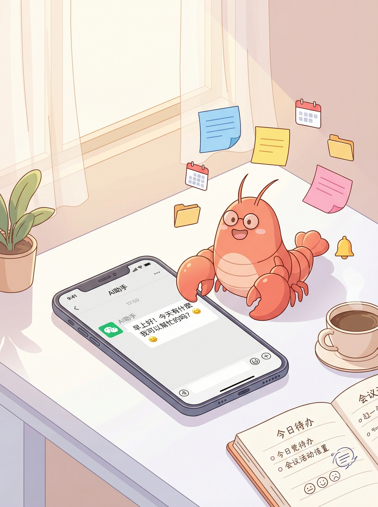
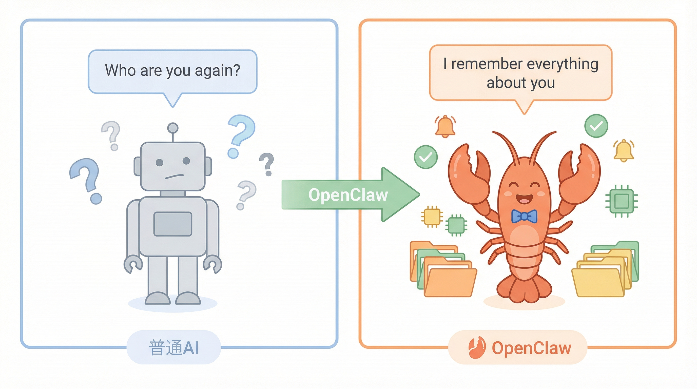
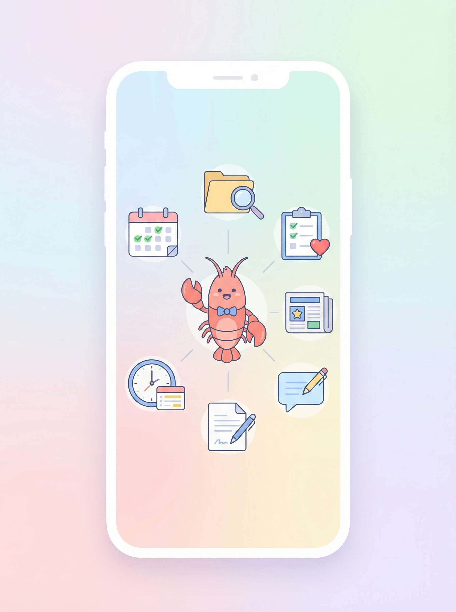
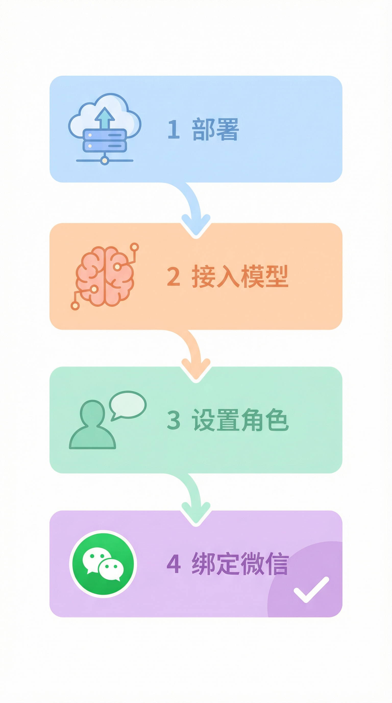
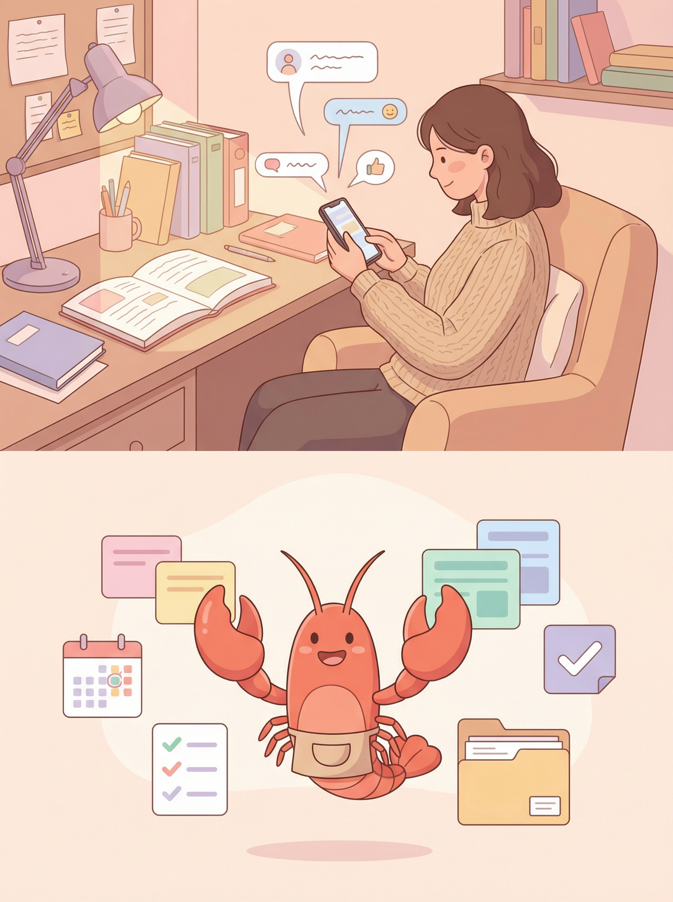
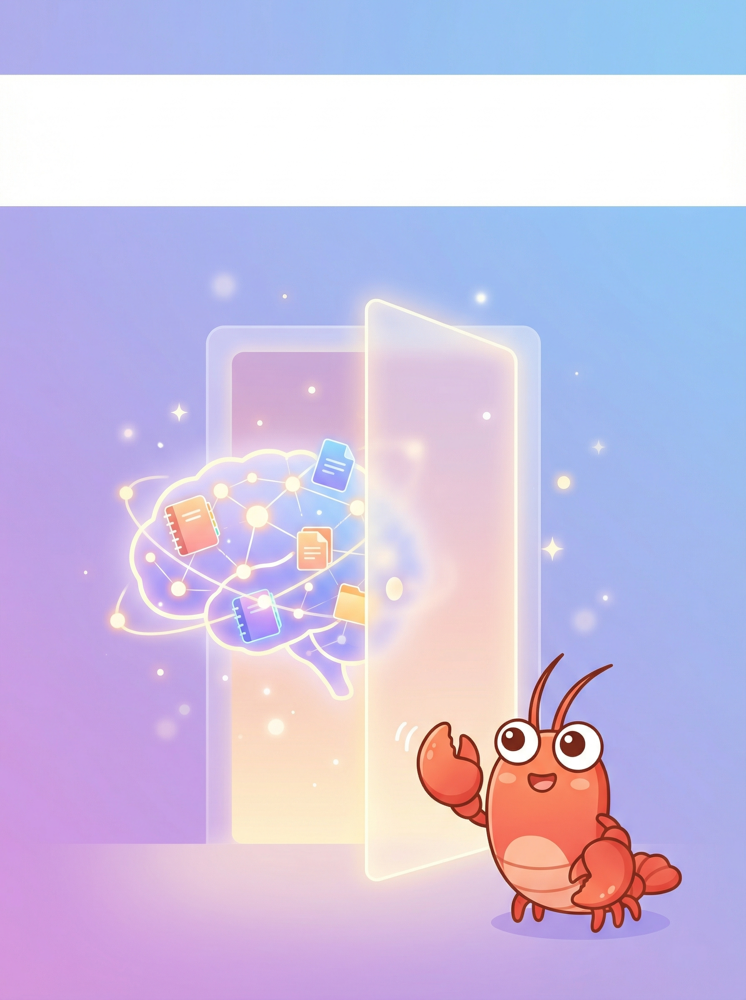

# 普通人的 AI 助手攻略｜用了2个月，真香了

姐妹们，今天想认真分享一个我用了两个月的工具。

不是我多爱追新，而是这个真的帮我解决了**每天忘事、文件找不到、会议记不住**这三个老大难问题。

不夸张地说，它现在是我手机上唯一一个我会主动打开的 AI 应用。

---

## 先说它是干啥的

**OpenClaw**（中文叫"龙虾"）

它不是普通的 AI 聊天机器人，它是——

一个**会记住你**的 AI 助手

普通 AI 聊完就忘，每次对话都是从零开始。

OpenClaw 不一样，你告诉它的事它会记住，下次继续聊它知道你是谁、你在做什么项目。

**就这么一个区别，解决了我 90% 的痛点。**



---

## 普通人能用它干啥

### 📋 帮我记住所有事情

开会纪要发给它，过一周问它，它还能找出来。

比存文件强在哪？

**不用自己分类、不用记存在哪，问它就行。**

### 🔔 帮我追踪习惯

"每天晚上9点提醒我做10分钟冥想"

"如果我连续3天没运动，就温和提醒我一下"

它会定期过问，不是那种压力很大的"你怎么又放弃了"，就是一句轻轻的提醒。

### 📊 帮我整理信息

"帮我搜集过去一周关于 AI 的重要新闻"

"把这份报告的核心数据整理一下"

设置好之后它自动跑，我只需要看结果。

### 📝 帮我起草文字

写周报、写道歉消息、写工作邮件

丢给它一个需求，它给初稿，我改改就发。

不用每次从空白页开始憋。



---

## 怎么装（超简单版）

分4步，跟着做不会错。

**第一步：部署**

腾讯云有一键部署，对着页面点几下就好，不需要懂代码。

**第二步：接一个"大脑"**

AI 需要接入大模型才能回答问题。

去腾讯混元注册拿 API Key，复制粘贴进去。

就这一步卡住很多人，我的经验是：

> 去平台控制台找到"API密钥"那一栏，复制粘贴，不用理解原理。

**第三步：告诉它你是谁**

发给它一段话：

```
我叫XX，在XX工作
我希望：
- 帮我记住重要的事
- 提醒我跟进的任务
- 帮我整理信息
```

它记住之后，之后对话都会基于你的背景。

**第四步：绑定微信（强烈推荐）**

这一步让它的实用性直接翻倍。

绑定后用微信发消息就能和 AI 对话，不用开电脑，手机上随手就能用。



---

## 我最常用的7个场景

### 1️⃣ 会议纪要存档

开完会，录音转文字发给它：
"这是XX项目第N次会议纪要，核心决策是XXX，我的Action Items是XXX"

之后问它："上周三那个项目讨论了什么？"

✅ 5秒钟出答案

### 2️⃣ 文件随手存

收到重要资料，直接发给它：
"这是XX行业报告，帮我存档"

以后问："之前存的XX报告核心数据是什么？"

✅ 不用翻文件夹

### 3️⃣ 习惯追踪

告诉它你的习惯要求，它定期过问：
"每天问我运动了没、喝水够不够"

连续没达标会温和提醒，不是那种劈头盖脸的指责。

✅ 帮我坚持了3个月的冥想

### 4️⃣ 每日资讯推送

设置每天早上自动搜集行业动态：
"帮我整理AI行业最重要的3条新闻"

设好一次，之后每天自动推送。

✅ 省掉了每天刷新闻的时间

### 5️⃣ 日程提前规划

每天晚上问它：
"明天我计划做XX，请帮我安排时间块"

它给我一个具体的时间表。

✅ 不用每天早上想"今天要干啥"

### 6️⃣ 周报生成

每天随手记几句当天做的事，周末发给它：
"帮我生成周报，格式：本周完成/遇到挑战/下周计划"

✅ 从"憋周报"变成"读周报"

### 7️⃣ 帮我起草文字

写消息、写邮件、写报告：
"帮我写一封给客户的道歉邮件，语气真诚但不卑微"

初稿给出来，我改30%就能发。

✅ 不用每次从空白页开始



---

## 一开始建议这样开始试

不要一上来就想把所有功能都配齐。

**挑一件你最烦的事，让它帮你。**

我建议你选：**让它帮你记一件事。**

试试看：
1. 把你在做的某个项目，发给 OpenClaw，说"帮我记住这是XX项目"
2. 过两天问它："我那个XX项目进展怎么样了？"
3. 如果它能找出来，你就明白这个东西值在哪了

有了感觉之后，自然会找到更多用得上的地方。

---



## 下期预告

下一期写：**用 OpenClaw + Obsidian 搭一个真正属于你的知识库**

让你的笔记不只是存起来，而是可以被 AI 检索、总结、关联。

感兴趣的话，记得关注我 👆

---

## 最后说一句

AI 不是万能药。

但如果有一件小事，你一直在忘、一直在烦——让它帮你扛一下这一件。

先试一件事。

没用就换件小事再试。

有用的地方就继续用。

就这样。

---

💬 **你在用什么 AI 工具？有什么让你头疼的事想自动化？评论区聊聊**

❤️ **觉得有用的话，点个赞让更多人看到**

🔖 **收藏起来慢慢看**

---

*— END —*
